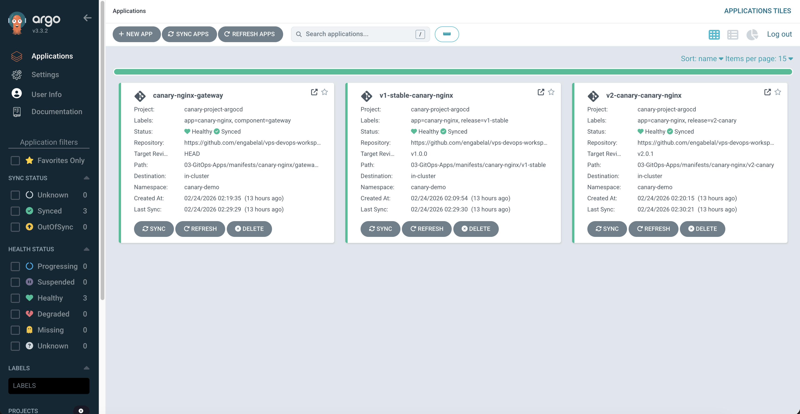
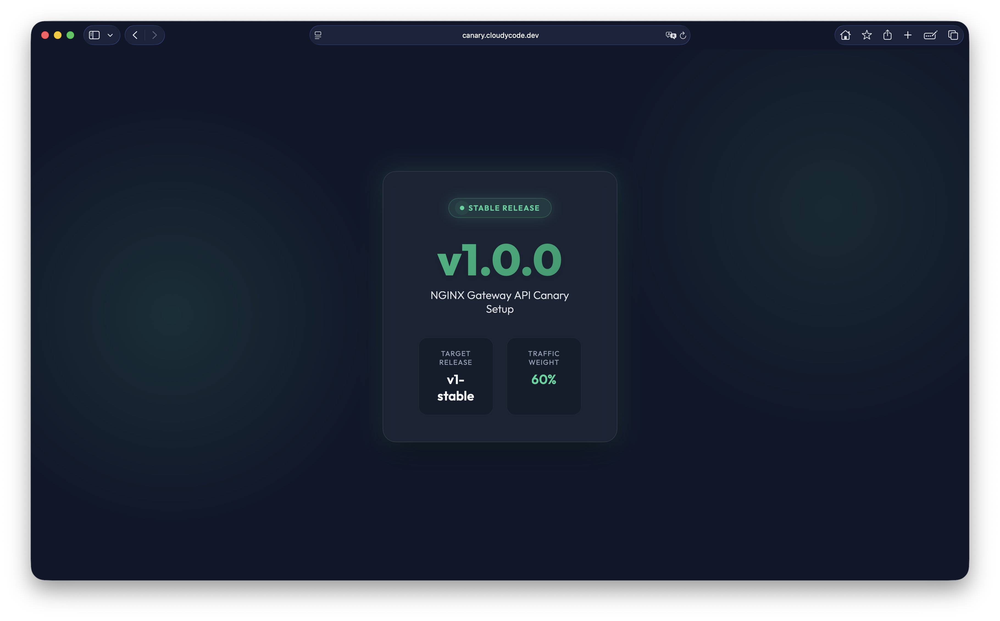
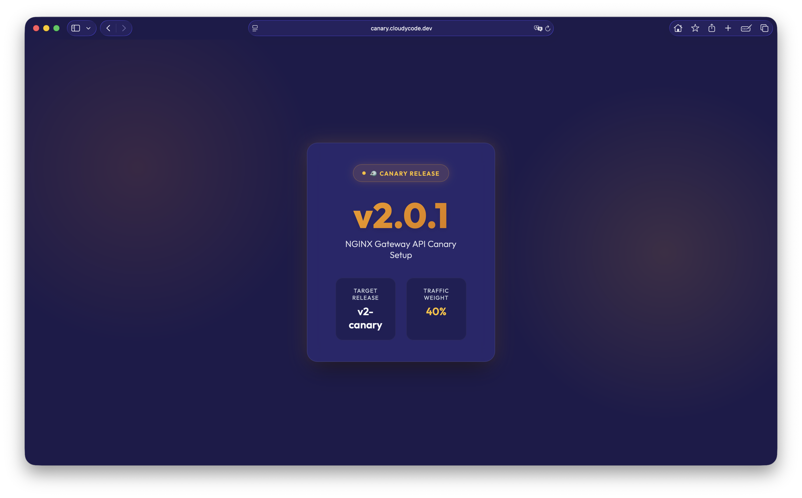
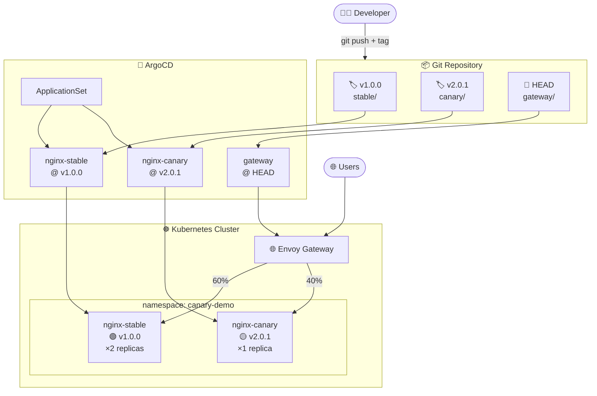

# 🐦 Kubernetes GitOps Canary Deployment Showcase

[](https://kubernetes.io/)
[](https://argoproj.github.io/cd/)
[](https://gateway-api.sigs.k8s.io/)
[](https://opensource.org/licenses/MIT)

> **Production-ready Canary Deployment using Kubernetes Gateway API, ArgoCD ApplicationSet, and GitOps principles**

A complete demonstration of progressive delivery with traffic splitting, automated deployments, and version management through Git tags.

---

## 🎯 Project Overview

This project showcases a **real-world Canary deployment** implemented on a **private VPS** using modern Kubernetes tools and GitOps practices. It demonstrates how to safely roll out new versions by gradually shifting traffic between stable and canary releases.

### 🚨 Important Note

> **This is a public showcase repository.** The actual production deployment is running on my **private VPS** with:
> - **Kubernetes v1.35** (kubeadm cluster)
> - **ArgoCD** connected to a private Git repository
> - **Envoy Gateway API** for traffic management
> - Live canary deployment with real traffic splitting
>
> This repository contains sanitized configurations and serves as a **portfolio demonstration** of the implementation. Screenshots are from the actual production environment.

### ✨ Key Features

- 🚀 **GitOps-driven deployments** - All changes managed through Git
- 🔄 **Automated traffic splitting** - 60/40 distribution between stable and canary
- 🏷️ **Git tag-based versioning** - Pin releases to specific tags
- 📊 **Real-time monitoring** - ArgoCD dashboard integration
- 🌐 **Gateway API routing** - Modern Kubernetes ingress with Envoy Gateway
- 🎨 **Beautiful UI** - Glassmorphism design with version indicators

---

## 📸 Screenshots

### ArgoCD Dashboard


### Stable Version (v1.0.0)


### Canary Version (v2.0.1)


---

## 🏗️ Architecture



---

## 📁 Project Structure

```
k8s-gitops-canary-showcase/
├── argocd/                        # ArgoCD configurations
│   ├── project.yaml               # AppProject definition
│   ├── applicationset.yaml        # Generates stable + canary apps
│   └── gateway-application.yaml   # Gateway routing app
│
├── k8s-manifests/                 # Kubernetes manifests
│   ├── base/                      # Shared resources
│   │   └── namespace.yaml
│   ├── stable/                    # 🏷️ Pinned to v1.0.0
│   │   ├── deployment.yaml
│   │   ├── service.yaml
│   │   └── configmap.yaml
│   ├── canary/                    # 🏷️ Pinned to v2.0.1
│   │   ├── deployment.yaml
│   │   ├── service.yaml
│   │   └── configmap.yaml
│   └── gateway/                   # 📄 Tracked at HEAD
│       └── httproute.yaml
│
├── docs/                          # Documentation & screenshots
│   └── images/
│
├── scripts/                       # Helper scripts
│   ├── setup.sh                   # Initial configuration
│   └── test-traffic.sh            # Test traffic distribution
│
├── .gitignore
├── LICENSE
└── README.md
```

---

## 🚀 Quick Start

> **Note:** These instructions are for replicating the setup in your own environment. The production deployment shown in screenshots is running on a private infrastructure.

### Prerequisites

- Kubernetes cluster (v1.25+)
- ArgoCD installed
- Envoy Gateway or any Gateway API implementation
- kubectl configured

### 1️⃣ Configure the Project

Run the setup script to configure for your environment:

```bash
./scripts/setup.sh
```

Or manually update:
- `argocd/*.yaml` - Replace `YOUR_USERNAME` with your GitHub username
- `k8s-manifests/gateway/httproute.yaml` - Replace `canary.example.com` with your domain

### 2️⃣ Create ArgoCD Project

```bash
kubectl apply -f argocd/project.yaml
```

### 3️⃣ Tag and Push

```bash
git add .
git commit -m "feat: initial canary deployment setup"
git tag v1.0.0
git tag v2.0.1
git push origin main --tags
```

### 4️⃣ Deploy Applications

```bash
kubectl apply -f argocd/
```

### 5️⃣ Verify Deployment

```bash
# Check ArgoCD apps
kubectl get applications -n argocd

# Check pods
kubectl get pods -n canary-demo

# Test traffic distribution
./scripts/test-traffic.sh your-domain.com 20
```

---

## 🧪 Testing Traffic Distribution

### Individual Requests

```bash
for i in {1..10}; do
  curl -sk https://canary.example.com/ | grep -o "v[0-9]\.[0-9]\.[0-9]"
done
```

**Expected output:**
```
v1.0.0
v2.0.1
v1.0.0
v1.0.0
v2.0.1
v1.0.0
v2.0.1
v1.0.0
v1.0.0
v2.0.1
```

### Distribution Count

```bash
./scripts/test-traffic.sh canary.example.com 20
```

**Expected output:**
```
🧪 Testing traffic distribution for: canary.example.com
📊 Sending 20 requests...

  12 v1.0.0
   8 v2.0.1

✅ Test completed!
```

---

## 🎮 Operations Guide

### Update Stable Version

1. Edit `k8s-manifests/stable/configmap.yaml`
2. Commit and create new tag:
   ```bash
   git add k8s-manifests/stable/
   git commit -m "feat: update stable to v1.1.0"
   git tag v1.1.0
   git push --tags
   ```
3. Update `argocd/applicationset.yaml` revision for stable
4. Push changes

### Update Canary Version

1. Edit `k8s-manifests/canary/configmap.yaml`
2. Commit and create new tag:
   ```bash
   git add k8s-manifests/canary/
   git commit -m "feat: update canary to v2.1.0"
   git tag v2.1.0
   git push --tags
   ```
3. Update `argocd/applicationset.yaml` revision for canary
4. Push changes

### Adjust Traffic Weights

Edit `k8s-manifests/gateway/httproute.yaml`:

```yaml
backendRefs:
  - name: nginx-stable-svc
    port: 80
    weight: 80  # Increase stable traffic
  - name: nginx-canary-svc
    port: 80
    weight: 20  # Decrease canary traffic
```

Commit and push - changes apply immediately (tracked at HEAD).

### Promote Canary to Stable

1. Test canary thoroughly
2. Update stable manifests with canary content
3. Create new stable tag
4. Update ApplicationSet
5. Shift traffic to 100% stable
6. Remove or update canary

---

## 🛠️ Technology Stack

| Component | Technology | Version | Purpose |
|-----------|-----------|---------|----------|
| **Container Orchestration** | Kubernetes (kubeadm) | v1.35 | Cluster management |
| **GitOps** | ArgoCD | Latest | Automated deployments |
| **Traffic Management** | Envoy Gateway API | v1.0+ | Intelligent routing |
| **Web Server** | NGINX | stable-alpine | Application runtime |
| **Version Control** | Git Tags | - | Release management |

### Production Environment

- 💻 **Infrastructure**: Private VPS
- ☸️ **Kubernetes**: v1.35 (kubeadm cluster)
- 🔄 **GitOps**: ArgoCD with private repository sync
- 🌐 **Ingress**: Envoy Gateway API implementation
- 🔒 **Security**: TLS/SSL enabled with custom domain

---

## 📚 Key Concepts

### GitOps Workflow

1. **Developer** makes changes and pushes to Git
2. **Git tags** pin specific versions (v1.0.0, v2.0.1)
3. **ArgoCD** detects changes and syncs to cluster
4. **Gateway API** routes traffic based on weights
5. **Users** experience gradual rollout

### Why Canary Deployments?

- ✅ **Reduced risk** - Test with small traffic percentage
- ✅ **Fast rollback** - Adjust weights instantly
- ✅ **Real user feedback** - Monitor actual usage
- ✅ **Gradual migration** - Smooth transition between versions

---

## 🎓 Learning Outcomes

This project demonstrates:

- ✅ GitOps principles with ArgoCD
- ✅ Kubernetes Gateway API usage
- ✅ Progressive delivery patterns
- ✅ Git-based version management
- ✅ Traffic splitting strategies
- ✅ ApplicationSet generators
- ✅ Multi-environment deployments

---

## 🔧 Troubleshooting

### ArgoCD Apps Not Syncing

```bash
# Check application status
kubectl get applications -n argocd

# View application details
kubectl describe application nginx-stable -n argocd

# Force sync
kubectl patch application nginx-stable -n argocd \
  --type merge -p '{"operation":{"initiatedBy":{"username":"admin"},"sync":{}}}'
```

### Traffic Not Splitting

```bash
# Check HTTPRoute
kubectl get httproute -n canary-demo

# Verify services
kubectl get svc -n canary-demo

# Check endpoints
kubectl get endpoints -n canary-demo
```

### Pods Not Starting

```bash
# Check pod status
kubectl get pods -n canary-demo

# View logs
kubectl logs -n canary-demo -l app=canary-nginx

# Describe pod
kubectl describe pod -n canary-demo <pod-name>
```

---

## 🤝 Contributing

Contributions are welcome! Feel free to:

- 🐛 Report bugs
- 💡 Suggest features
- 📝 Improve documentation
- 🔧 Submit pull requests

---

## 📝 License

This project is licensed under the MIT License - see the [LICENSE](LICENSE) file for details.

---

## 🙏 Acknowledgments

- **Production deployment** running on private VPS with Kubernetes v1.35 (kubeadm)
- **ArgoCD** connected to private Git repository for actual GitOps workflow
- **Envoy Gateway API** handling real traffic with canary distribution
- Inspired by modern GitOps and progressive delivery practices
- Uses open-source tools from the CNCF ecosystem
- Screenshots captured from live production environment

---

## 📬 Contact

For questions or feedback, please open an issue in this repository.

---

**⭐ If you find this project helpful, please consider giving it a star!**
